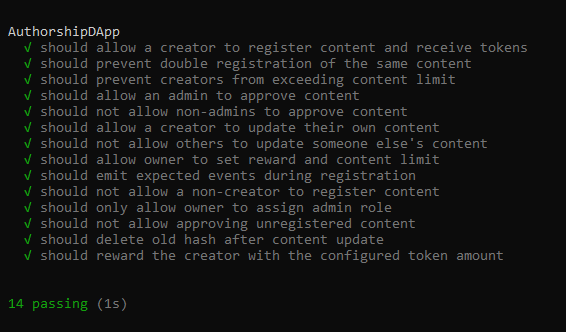

# AuthorshipDApp: Decentralized Proof of Authorship 📝🔗

**AuthorshipDApp** is a personal Proof of Concept (POC) designed to explore the use of **blockchain** technology for **registering** and **verifying content authorship**. Users can securely register their original works—such as **articles**, **code**, or other creative content—on the blockchain, creating an **immutable proof of authorship** that is **transparent**, **secure**, and **verifiable**. 🚀🔐

The goal of this project is to understand how blockchain can be leveraged to protect **intellectual property** and establish **verifiable ownership** of digital content 🧠💡. Through this hands-on approach, the project aims to provide insight into how **decentralized systems** can be used for **proof of ownership** and **content verification** in the digital world 🌍⚖️.

<p align="center">
  
  
  
  
</p>

## ⚠️ Disclaimer

This project is developed for **educational purposes** only. It is designed to provide hands-on experience and deepen knowledge in **blockchain technology**, **Solidity**, and **decentralized application (DApp)** development, specifically in the context of **digital content authorship verification**. It is **not intended** for use in production environments or real-world applications.

The primary focus of this project is to explore **blockchain-based proof of authorship**, **smart contract development**, and the mechanisms of **decentralized verification** with an emphasis on transparency, immutability, and content authenticity.

The name "AuthorshipDApp" was generated during a creative brainstorming session using ChatGPT.

## 🎯 Purpose

**AuthorshipDApp** is a decentralized application (DApp) created as a proof of concept to explore how blockchain technology can be used to establish, verify, and reward content creators for their intellectual property in a transparent and secure way.

The main objectives of this project are:

- ✅ **Proof of Authorship**: The DApp allows creators to register their content on the blockchain by submitting a unique content hash. This ensures a public, immutable record of ownership.
- 🎁 **Reward System**: Creators are rewarded with ERC-20 tokens for each piece of content they register, demonstrating how blockchain can facilitate direct incentivization.
- 🛡️ **Role-based Moderation**: The DApp uses smart contract-based roles, such as `CREATOR` and `ADMIN`, to control who can register, update, and approve content. This introduces decentralized content moderation.
- 📈 **Version Control**: The system supports content updates, with each new version being properly tracked and recorded on the blockchain. This helps ensure content authenticity even as it evolves.
- ⛓️ **Decentralization**: The project showcases how blockchain technology can be used to reduce reliance on centralized platforms for content management and reward distribution, promoting user autonomy.

This project serves as an educational example of how blockchain could potentially disrupt traditional content management systems by providing creators with more control, transparency, and rewards, all in a decentralized manner.

## 🧱 Technologies Used

This project leverages several modern technologies to create a decentralized content registration and reward distribution system. Below are the key technologies used:

### 🔗 **Blockchain: Polygon (Layer 2 Solution for Ethereum)**
- The core of this project is built on the **Polygon** network, a **Layer 2 scaling solution** for Ethereum. Polygon enhances Ethereum’s scalability by offering faster and cheaper transactions while retaining the security and decentralization of the Ethereum network.
- By utilizing Polygon, the application ensures that users can interact with the system without the high gas fees typically associated with Ethereum's mainnet, while still benefiting from the security guarantees of Ethereum.

### 🛠️ **Solidity**
- **Solidity** is the primary programming language used to write the smart contracts for this project. It allows us to define the logic for content registration, approval, version control, and reward management.
- The contract also incorporates role-based access control (with the `AccessControl` contract) to manage permissions, allowing only authorized creators and admins to interact with the content.

### 💎 **OpenZeppelin Contracts**
- We rely on **OpenZeppelin**'s battle-tested smart contract library, which provides standardized, secure, and reusable implementations for common contract patterns:
  - **Ownable**: To handle ownership and administration of the contract.
  - **AccessControl**: For managing roles like `CREATOR` and `ADMIN` within the DApp.
  - **ReentrancyGuard**: To prevent reentrancy attacks, ensuring that functions are secure during execution.
  - **IERC20**: Interface for handling ERC-20 token interactions, enabling the reward system.

### 🚀 **Hardhat**
- **Hardhat** is a development environment used for building, testing, and deploying smart contracts.
- It simplifies the workflow by allowing us to easily compile contracts, run tests, and deploy them on Ethereum networks, including Polygon’s network.
- Hardhat’s built-in network emulation also makes it easy to test the DApp locally before deployment.

### 🎉 **ERC-20 Token (Reward System)**
- The project utilizes an **ERC-20 token** as a reward mechanism for creators. This token is transferred to content creators whenever they register new content, ensuring they are incentivized for their contributions.
- ERC-20 is a standard for fungible tokens on the Ethereum blockchain, providing interoperability with other projects and platforms.

### 🧪 **Chai & Mocha (Testing Framework)**
- **Chai** and **Mocha** are used to write and execute unit tests for the smart contracts.
  - **Chai** provides a BDD (Behavior-Driven Development) assertion library to test the contract’s logic.
  - **Mocha** is the testing framework that allows us to run our tests, providing hooks and a clean test structure.

## 🧩 Key Components

This project consists of several key components that work together to enable decentralized content registration, management, and reward distribution. Below are the main components that drive the functionality of the system:

### 1. **Smart Contracts** 🧠
- **AuthorshipDApp Contract**: The central smart contract of the project, responsible for managing content registration, updates, approval, and rewards. This contract enforces logic for:
  - Registering new content by creators.
  - Updating existing content and versioning.
  - Assigning roles (CREATOR, ADMIN) and managing content approval.
  - Distributing ERC-20 token rewards to content creators upon registration.
  - Implementing role-based access control via **OpenZeppelin AccessControl**.
  
- **RewardToken Contract** 🎉: This contract represents the ERC-20 token used as a reward for content creators. The **RewardToken** contract interacts with the **AuthorshipDApp** contract to reward creators for registering content. This token follows the standard ERC-20 implementation, enabling interoperability with other projects and wallets.

### 2. **Content Registration & Management System** 📂
- The core functionality of the DApp revolves around the **content registration** and **management system**. Creators can register content by providing a unique content hash (e.g., `QmHash`). Once the content is registered:
  - The content is associated with the creator’s address.
  - The content hash and creator information are stored on the blockchain.
  - Creators can update their content, and a new version is tracked.
  
- **Content Approval** ✅: After registration, content can be approved by an **Admin**. Admins are granted special roles within the contract and have the power to approve or reject content. This ensures that only verified or trusted content is publicly accessible.

### 3. **Role-Based Access Control (RBAC)** 🔒
- **Role Management**: The **AuthorshipDApp** uses **OpenZeppelin's AccessControl** to define roles within the system. The two main roles are:
  - **CREATOR** ✍️: This role is granted to individuals who can register and update content. Creators are allowed to interact with content, but their actions are subject to approval by admins for certain operations.
  - **ADMIN** 🛠️: Admins have special permissions to approve or reject content. Admins are usually responsible for maintaining the integrity and quality of the content in the platform.
  
- The roles are assigned and managed through functions like `addCreator` and `assignAdminRole`, ensuring that only authorized users can perform sensitive actions.

### 4. **Reward System** 🎁
- **Reward Token**: Creators are rewarded for registering content through the distribution of **ERC-20 tokens**. The **RewardToken** contract mints tokens and sends them to the creator’s address after each successful content registration.
  
- The amount of tokens distributed is set by the contract owner and can be adjusted to suit the project’s needs. For instance, each content registration could be rewarded with a fixed amount of tokens, incentivizing creators to contribute high-quality content.

### 5. **Event Logging** 📜
- Events are an integral part of this project as they allow for tracking key actions within the system. Notable events include:
  - **ContentRegistered** 📋: Triggered whenever a new piece of content is successfully registered by a creator.
  - **ContentUpdated** 🔄: Triggered when a creator updates their existing content.
  - **RewardClaimed** 💸: Emitted when a creator receives their reward for registering content.
  - **AdminAdded** ➕ and **AdminRemoved** ➖: Used to log changes in admin roles within the system.
  
  Events help to provide transparency and accountability, and they are useful for frontend applications and off-chain services that listen for these events.

### 6. **Testing and Deployment** 🚀
- **Hardhat** is used as the development environment for deploying and testing the contracts. The tests ensure that the smart contracts behave as expected and handle edge cases such as unauthorized access, double registrations, and reward distribution.
  
- The contract deployment process involves deploying both the **AuthorshipDApp** and **RewardToken** contracts on the Polygon network, ensuring that the system can scale and operate at a low cost in production.

### 7. **Security Features** 🛡️
- **ReentrancyGuard** 🦹‍♂️: To prevent reentrancy attacks during token transfers and content updates, the system uses **ReentrancyGuard** from OpenZeppelin.
- **Access Control** 🔑: Only authorized accounts (Creators and Admins) can perform specific actions, preventing unauthorized users from registering content or approving content.
- **Non-Reentrant Functions** 🚫: Functions that deal with financial transactions (like reward distribution) are marked as non-reentrant to ensure secure execution.

## 🛠️ Installation
First, clone the repository:

```bash
git clone https://github.com/sergio11/authorship_dapp_blockchain.git
cd authorship_dapp_blockchain
```
Install the necessary dependencies:

```bash
npm install
```

## 🧪 Testing

Testing plays a vital role in ensuring the functionality, security, and reliability of the **AuthorshipDApp** smart contract. The tests are designed to validate key operations such as **content registration**, **content updates**, **content approval**, and **reward distribution**, ensuring that the system works as expected in a decentralized content management environment.

The primary goal of these tests is to simulate real-world scenarios in a decentralized content platform, ensuring correct access control, content management, and token reward distribution.

### ✅ What We Test

- ✍️ **Content Registration** – Verifies that creators can register new content with a unique identifier (hash) and receive reward tokens.
- 🔄 **Content Updates** – Ensures that creators can update their own content and increment its version, and that content updates are properly recorded.
- ✅ **Content Approval** – Confirms that only admin users can approve or reject content, ensuring proper content curation and platform integrity.
- 💎 **Reward Distribution** – Validates that creators are properly rewarded for registering content and that rewards are distributed correctly.
- 🔐 **Role-Based Access Control** – Ensures that only authorized roles (CREATOR, ADMIN) can perform sensitive actions such as content registration, content updates, and approval.
- 🛡️ **Security** – Tests unauthorized access attempts, ensures proper handling of non-creator users trying to update content, and checks for reentrancy protections to prevent attacks.

### 🧪 Running the Tests

To run the tests, use the following command:

```shell
npx hardhat test
```

> 📦 The test suite is written using **Mocha** and **Chai**, with **Ethers.js** for contract interaction, all integrated within the **Hardhat** development environment.



## 🧪 Learning Outcomes

Building this project has been a valuable hands-on experience in understanding how decentralized applications operate, especially within the context of content ownership and creator incentivization.

### 📘 What I Learned

- 🧱 **Solidity & Smart Contracts** – Gained practical experience writing and organizing smart contracts, using inheritance (`Ownable`, `AccessControl`, `ReentrancyGuard`) and interfaces to promote modularity and security.
- 🧑‍💻 **Role Management** – Learned how to define and enforce different roles (creator, admin, owner) using `AccessControl`, and how these roles interact to create a secure access model.
- 📄 **Content State & Lifecycle** – Implemented logic to manage and update content metadata (e.g., hashes, timestamps, versions), ensuring immutability and traceability in a decentralized context.
- 🎯 **Testing with Hardhat** – Practiced writing robust unit tests to simulate realistic user interactions and verify contract behavior, using `chai`, `ethers`, and Hardhat matchers.
- 🛡️ **Security Practices** – Understood and applied protection mechanisms like reentrancy guards and restricted function access to prevent vulnerabilities.
- 🌍 **Token Integration** – Integrated an ERC20 token to reward creators for content registration, and learned how token economics can be tied to user engagement.
- ⚡ **Polygon Deployment Concepts** – Explored the use of Polygon as a Layer 2 solution to reduce gas costs and improve scalability, which is critical for content-heavy decentralized apps.

## ⚠️ Disclaimer

This project is developed for **educational purposes** only. It is designed to provide hands-on experience and deepen knowledge in **blockchain technology**, **Solidity**, and **decentralized application (DApp)** development, specifically in the context of **digital content authorship verification**. It is **not intended** for use in production environments or real-world applications.

The primary focus of this project is to explore **blockchain-based proof of authorship**, **smart contract development**, and the mechanisms of **decentralized verification** with an emphasis on transparency, immutability, and content authenticity.

The name "AuthorshipDApp" was generated during a creative brainstorming session using ChatGPT.

## License ⚖️

This project is licensed under the MIT License, an open-source software license that allows developers to freely use, copy, modify, and distribute the software. 🛠️ This includes use in both personal and commercial projects, with the only requirement being that the original copyright notice is retained. 📄

Please note the following limitations:

- The software is provided "as is", without any warranties, express or implied. 🚫🛡️
- If you distribute the software, whether in original or modified form, you must include the original copyright notice and license. 📑
- The license allows for commercial use, but you cannot claim ownership over the software itself. 🏷️

The goal of this license is to maximize freedom for developers while maintaining recognition for the original creators.

```
MIT License

Copyright (c) 2025 Sergio Sánchez 

Permission is hereby granted, free of charge, to any person obtaining a copy
of this software and associated documentation files (the "Software"), to deal
in the Software without restriction, including without limitation the rights
to use, copy, modify, merge, publish, distribute, sublicense, and/or sell
copies of the Software, and to permit persons to whom the Software is
furnished to do so, subject to the following conditions:

The above copyright notice and this permission notice shall be included in all
copies or substantial portions of the Software.

THE SOFTWARE IS PROVIDED "AS IS", WITHOUT WARRANTY OF ANY KIND, EXPRESS OR
IMPLIED, INCLUDING BUT NOT LIMITED TO THE WARRANTIES OF MERCHANTABILITY,
FITNESS FOR A PARTICULAR PURPOSE AND NONINFRINGEMENT. IN NO EVENT SHALL THE
AUTHORS OR COPYRIGHT HOLDERS BE LIABLE FOR ANY CLAIM, DAMAGES OR OTHER
LIABILITY, WHETHER IN AN ACTION OF CONTRACT, TORT OR OTHERWISE, ARISING FROM,
OUT OF OR IN CONNECTION WITH THE SOFTWARE OR THE USE OR OTHER DEALINGS IN THE
SOFTWARE.
```
